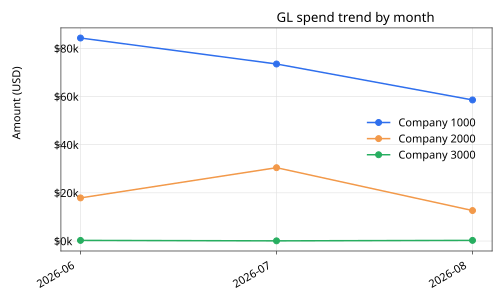
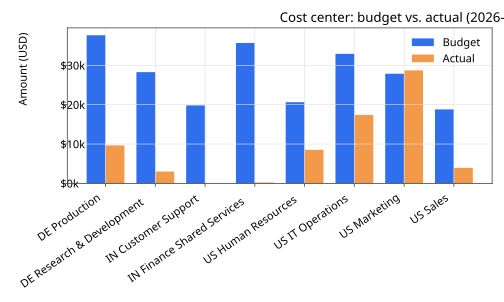

# SAP FICO Data Analytics Dashboard

An interactive Python analytics layer over synthetic SAP FI/CO data — GL
postings, AP/AR invoices, and cost center budgets — built as the kind of
self-service reporting tool a Finance Systems Analyst puts together when
Finance needs answers faster than a custom SAP report or a manual pivot
table can deliver.

## Why this project

SAP is where the transactional data lives, but SAP's own reporting tools
(FBL3N, KSB1, S_ALR_* reports) aren't built for interactive, filterable
analysis. In practice, a Finance Systems Analyst extracts the data and
turns it into something the business can actually explore: spend trends,
AP/AR aging, and budget-vs-actual by cost center. This project simulates
that workflow end-to-end — synthetic data in, interactive dashboard and
BI-ready exports out.

## What it does

1. `src/generate_data.py` generates four related synthetic extracts shaped
   like real SAP data: GL postings (document number, company code, cost
   center, GL account, amount), AP invoices (vendor, due date, status), AR
   invoices (customer, due date, status), and a monthly cost center budget.
   By default it generates 12 months of data; the committed `data/` sample
   in this repo is a smaller 3-month version so it's easy to review
   directly on GitHub.
2. `src/app.py` is an interactive **Streamlit** dashboard: KPI cards, a GL
   spend trend, cost center budget vs. actual, AP/AR aging, spend by GL
   account, and top vendors — all filterable by company code, cost center,
   and posting date.
3. `src/build_export.py` turns the same data into a clean, BI-ready export
   (`exports/`): flat CSVs for GL postings, AP/AR aging (with computed
   aging buckets and days-to-pay), cost center budget vs. actual, and a KPI
   summary — ready to drop straight into Power BI or Tableau. Pass `--xlsx`
   to also bundle everything into one workbook.
4. `src/generate_previews.py` renders a couple of the dashboard's charts as
   static SVGs for the README below, so you don't need to run the app to
   see what it produces.

## Dashboard preview

Rendered from the committed 3-month sample data:





The live app also includes AP/AR aging, spend-by-GL-account, and
top-vendor charts — see `src/app.py`.

## Data model

| File | Grain | Key fields |
|---|---|---|
| `gl_postings.csv` | One row per GL line item | `document_number`, `posting_date`, `company_code`, `cost_center`, `gl_account`, `amount_usd` |
| `ap_invoices.csv` | One row per vendor invoice | `invoice_number`, `vendor_name`, `due_date`, `status`, `amount_usd` |
| `ar_invoices.csv` | One row per customer invoice | `invoice_number`, `customer_name`, `due_date`, `status`, `amount_usd` |
| `cost_center_budget.csv` | One row per cost center per month | `cost_center`, `period`, `budget_amount_usd`, `actual_amount_usd`, `variance_usd` |

All monetary fields keep both the original transaction currency (USD, EUR,
or INR depending on company code) and an `amount_usd` field converted at a
fixed FX rate, so cross-company-code totals are meaningful.

## Project structure

```
sap-fico-analytics-dashboard/
├── data/                       # Synthetic GL/AP/AR/budget extracts (CSV)
├── exports/                    # BI-ready CSV exports (generated)
├── assets/                     # Static chart previews for this README
├── src/
│   ├── generate_data.py        # Regenerate or swap in your own extracts
│   ├── app.py                  # Streamlit dashboard
│   ├── build_export.py         # Power BI / Tableau ready CSV (+ optional .xlsx) export
│   └── generate_previews.py    # Static SVG chart previews for the README
├── requirements.txt
└── README.md
```

## Getting started

```bash
python -m venv venv
source venv/bin/activate        # Windows: venv\Scripts\activate
pip install -r requirements.txt

# 1. Generate (or regenerate) the synthetic extracts (12 months by default)
python src/generate_data.py

# 2. Run the interactive dashboard
streamlit run src/app.py

# 3. Build the Power BI / Tableau ready export
python src/build_export.py --xlsx

# 4. (optional) Regenerate the static chart previews used in this README
python src/generate_previews.py
```

Swap the `data/*.csv` files for real (anonymized) SAP extracts and
everything downstream — the dashboard, the aging logic, the export —
works unchanged, since the column names match standard SAP FI/CO extract
fields (`document_number`, `cost_center`, `gl_account`, `posting_date`,
`due_date`).

## Sample output

The committed sample dataset (3 months, 8 cost centers, 3 company codes:
72 GL postings, 16 AP invoices, 11 AR invoices) produces roughly $278k of
GL spend, ~$41k AP outstanding (~$21k overdue), ~$116k AR outstanding, an
average of 18-19 days to pay vendors, and 1 of 8 cost centers over budget
in the latest period — see `exports/kpi_summary.csv` for the exact
figures. Running `generate_data.py` with its default settings produces the
full 12-month dataset (roughly 1,400 GL postings and 500+ AP/AR invoices),
which the dashboard and export scripts handle identically.

## Possible next steps

- Deploy the Streamlit app to Streamlit Community Cloud for a live,
  clickable link instead of a static preview.
- Add simple anomaly/outlier flagging on the GL trend (e.g. a cost center
  whose month-over-month spend jumps more than N standard deviations).
- Wire the loaders up to real SAP extracts (FBL3N / FBL1N / FBL5N / KSB1)
  instead of the synthetic generator.
- Add a drill-through from a cost center in the budget-vs-actual chart to
  its underlying GL line items.

## Tech stack

Python 3, `pandas` for data wrangling, `streamlit` + `plotly` for the
interactive dashboard, `openpyxl` for the optional Excel export, and
`matplotlib` (dev-only) for the static README previews.
